# ioBroker Backup Analyzer

Werkzeug, das ioBroker-Backups (Backitup) **offline** einliest und analysiert — ohne
laufendes ioBroker-System, ohne Adapter-Installation, per Doppelklick startbar.

Reines Lesewerkzeug: Es schreibt nichts in ein ioBroker-System und löscht nichts.

> **Mit KI erstellt.** Diese Anwendung wurde vollständig mit KI erstellt: Programmcode,
> Auswertungslogik und sämtliche Texte stammen von Claude (Anthropic), erarbeitet in Claude
> Code. Jede Auswertung ist gegen echte ioBroker-Backups verifiziert (siehe
> [STRUKTUR_VERIFIZIERUNG.md](STRUKTUR_VERIFIZIERUNG.md) und den Verifikationslauf mit
> derzeit 560 Prüfungen, davon 12 nur, wenn eine bash erreichbar ist). Trotzdem gilt:
> Die Listen sind Prüflisten — was gelöscht oder geändert wird, entscheidest du. Der
> Hinweis steht auch in der App: in der Titelleiste, in der Statusleiste, in der Hilfe und
> in jeder Datei, die das Werkzeug erzeugt.

Es gibt das Werkzeug in **drei Oberflächen** mit gemeinsamer Kernlogik:

| Fassung | Läuft unter | Grundlage |
|---|---|---|
| **Windows-Fassung** | Windows | WinForms |
| **plattformübergreifende Fassung** | Windows, macOS, Linux | Avalonia |
| **Browser-Fassung** | jeder Browser, ausgeliefert vom eigenen Webserver | Blazor WebAssembly |

Alle drei zeigen dieselben Auswertungen — die Analysen liegen in `Core` und können deshalb
nicht je Oberfläche auseinanderlaufen. Unterschiede gibt es nur dort, wo die
Bedienoberflächen selbst welche vorgeben; sie sind unten jeweils genannt.

Auch bei der Browser-Fassung wird **nichts hochgeladen**: Der Server liefert nur das
Programm aus, gelesen und gerechnet wird im Browser des Anwenders. Siehe
[Browser-Fassung](#browser-fassung).

---

## So sieht es aus

> **Alle Bilder zeigen ein erfundenes Beispiel-Backup.** Es wurde eigens dafür erzeugt und
> beschreibt ein Haus, das es nicht gibt: Jede Objekt-ID, jeder Gerätename, jeder Wert und
> jedes Skript darin ist ausgedacht. Kein Bild zeigt Daten einer echten Anlage. Auch die
> Befunde sind absichtlich hineingebaut — Karteileichen, ein Alias ins Leere, tote
> Widgets —, damit die Listen zeigen können, wofür sie da sind. Was ein echtes Backup
> ergibt, sieht anders aus, meist deutlich umfangreicher.

### Windows-Fassung

Die Übersicht nach dem Laden: Adapter-Instanzen mit Version und Objektzahl, darunter die
installierten Adapter ohne eigene Instanz.

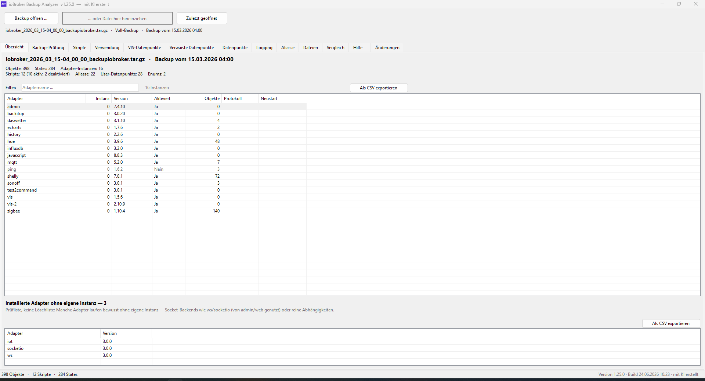

Die Kreuzreferenz zwischen Skripten und Datenpunkten — umschaltbar in beide Richtungen,
mit Blockly-Skripten gleichberechtigt neben JavaScript.

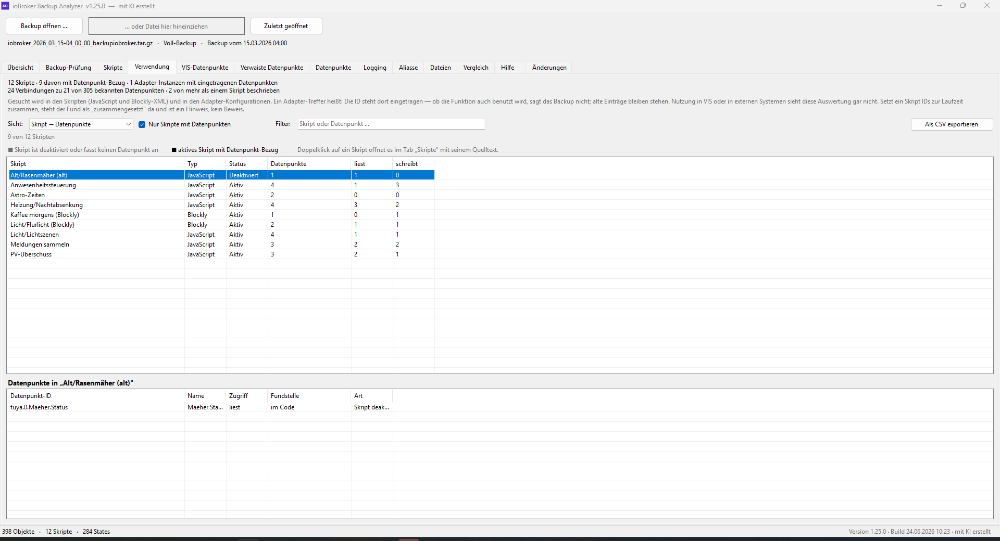

Alle in der Visualisierung verwendeten Datenpunkte, getrennt nach VIS 1 und VIS 2. Unten
jede einzelne Fundstelle mit View, Widget-ID, Widget-Typ und dem Feld, in dem der
Datenpunkt steckt. In derselben Kopfleiste schreibt „Projekt als ZIP (VIS-Import)" ein
ganzes VIS-Projekt aus dem Backup — im Aufbau, den „Tools → Projektimport" in VIS 1 und
VIS 2 erwartet. So lässt sich eine gelöschte Ansicht zurückholen, ohne das Backup
einzuspielen: importieren, die vermisste Ansicht über „Views → Exportieren" herausholen,
im eigenen Projekt einfügen. Der vorgeschlagene Dateiname ist dabei kein Beiwerk — VIS
trägt ihn beim Hineinziehen selbst als Projektnamen ein (ohne führendes Datum), und er ist
deshalb so gewählt, dass er das laufende Projekt nicht treffen kann.

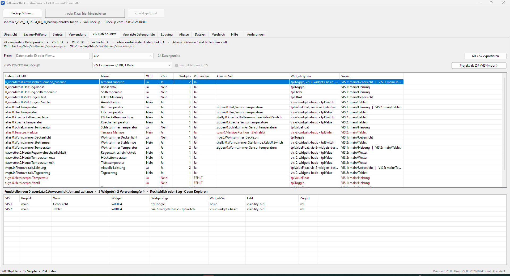

Die Verwaisten-Analyse in drei Sichten. Hier Sicht A: Objekte, deren Adapter-Instanz im
Backup fehlt.

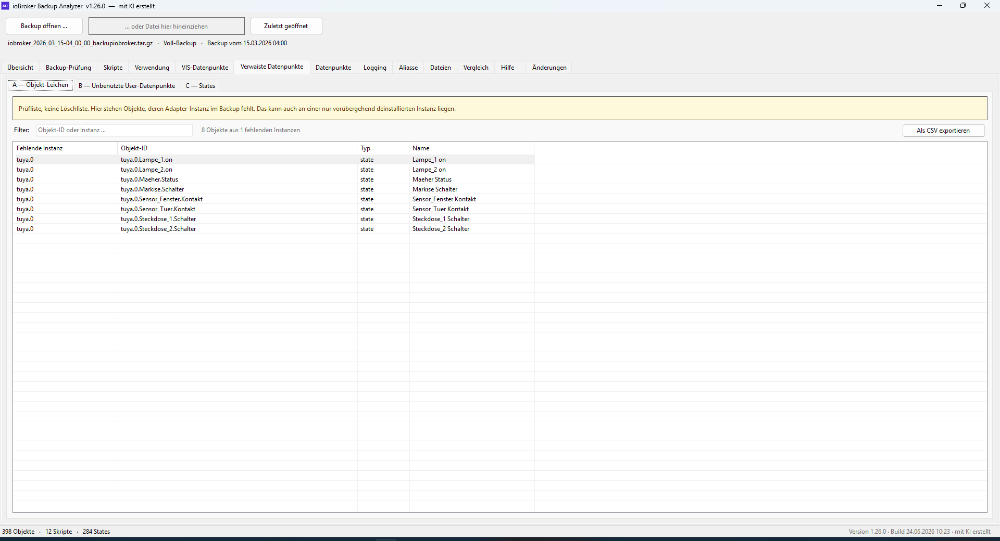

Suche über Datenpunkt-ID und Name; unten steht der zuletzt gespeicherte Wert vollständig
und lässt sich kopieren. Über dem Wertfeld die Beschreibung des Datenpunkts und die Herkunft
des Werts. Orange stehen Werte, zu denen kein Objekt mehr existiert; grau Datenpunkte ohne
Wert.

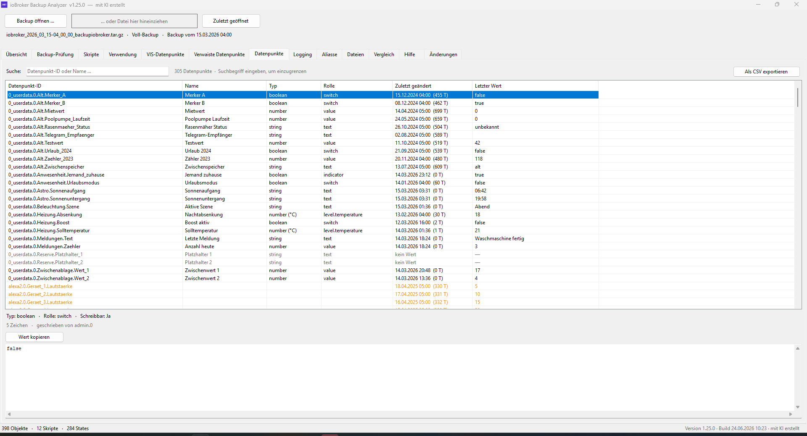

Aliasse samt Ziel. Zeigt ein Alias ins Leere, steht die Zeile rot — im Beispiel zwei Stück.

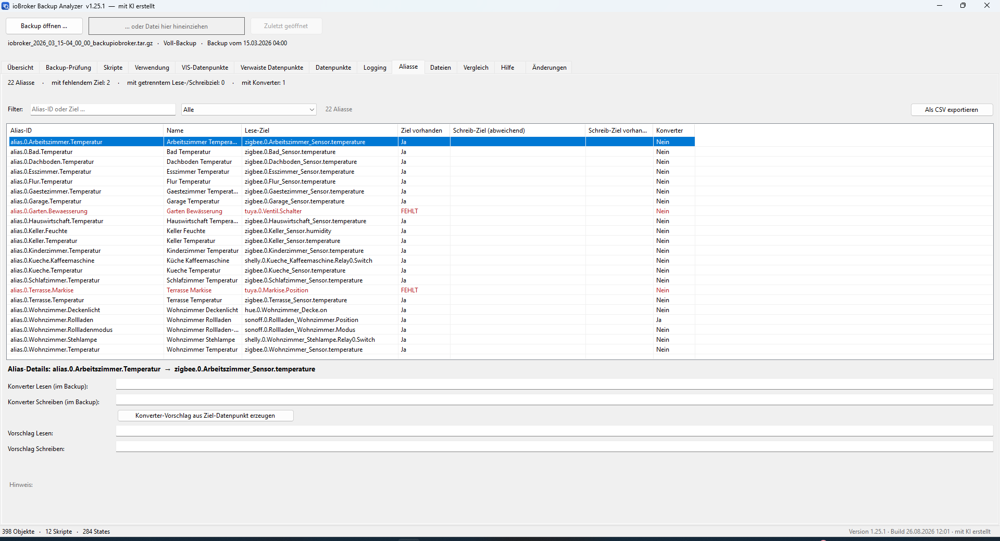

Je Datenpunkt und loggender Instanz eine Zeile: ob das Logging aktiv ist, ob nur
Änderungen geschrieben werden und welche Entprellzeit gilt.

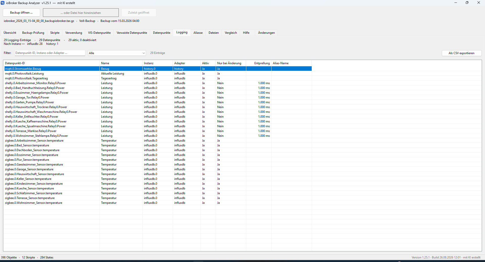

Die Skriptliste mit der Spalte „Hinweise". Das ausgewählte Blockly-Skript trägt drei
Befunde; unter der Liste stehen sie ausformuliert, jeweils mit der Baustein-ID, unter der
sie auch der Blockly-Editor führt.

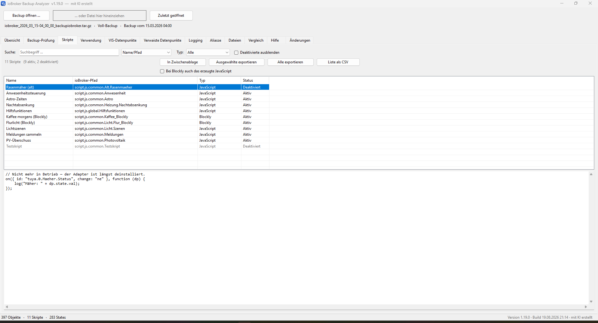

Weitere Tabs als Bild: [Backup-Prüfung](docs/bilder/windows/02-backup-pruefung.png) ·
[Dateien](docs/bilder/windows/10-dateien.png) ·
[Vergleich](docs/bilder/windows/11-vergleich.png)

### Plattformübergreifende Fassung

Dieselben Auswertungen, andere Oberfläche — hier im dunklen Erscheinungsbild, das sie vom
System übernimmt.

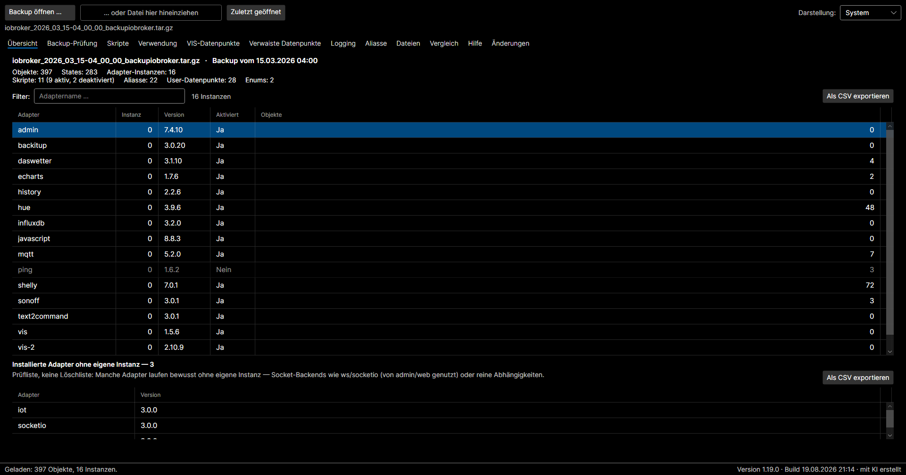

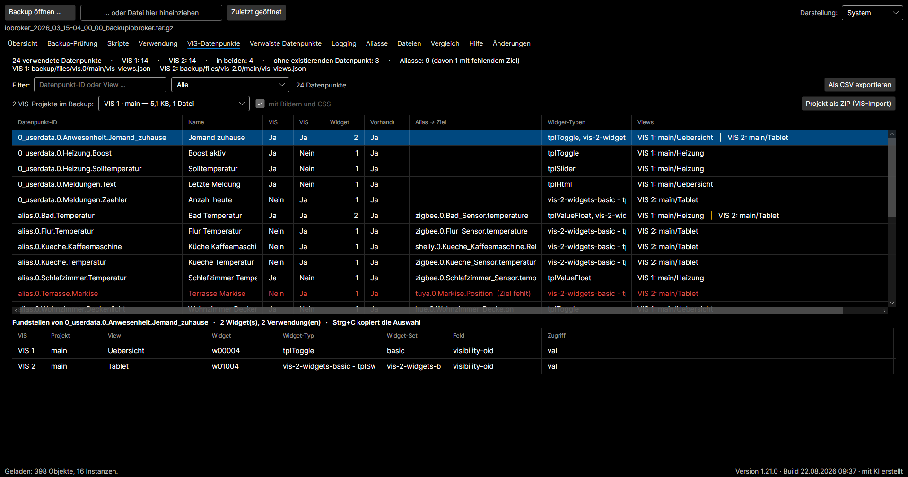

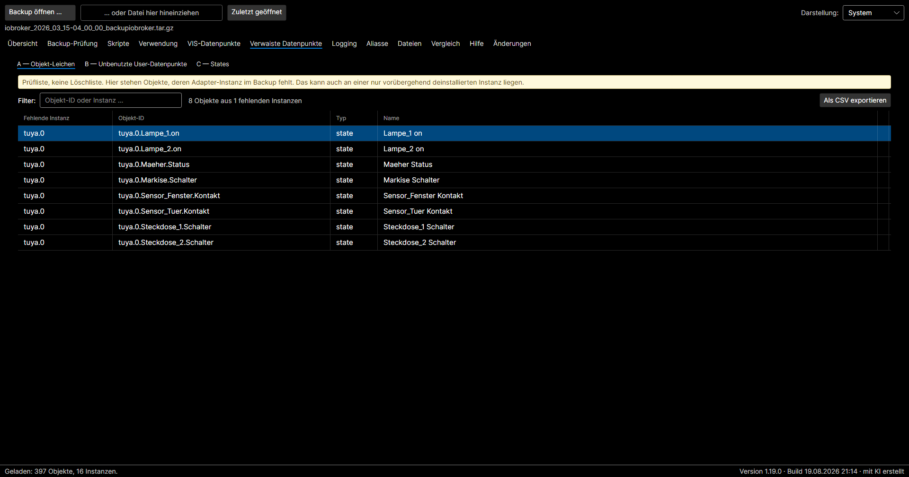

---

## Benutzung

`build.ps1` legt alle Pakete unter `dist/` ab — sämtlich ohne installiertes .NET und
portabel:

| Datei | Fassung | Empfehlung | Bedienung |
|---|---|---|---|
| **`ioBroker-Backup-Analyzer_Ordner.zip`** (~64 MB) | Windows | **verlässliche Wahl** | entpacken, enthaltene EXE doppelklicken |
| `ioBroker-Backup-Analyzer.exe` (~140 MB) | Windows | nur, wenn sie auf dem Zielrechner startet | Doppelklick |
| `plattformuebergreifend/…_Windows-x64.zip` (~43 MB) | plattformübergreifend | | entpacken, EXE starten |
| `plattformuebergreifend/…_macOS-AppleSilicon.tar.gz` (~42 MB) | plattformübergreifend | für Apple Silicon | entpacken, `.app` starten |
| `plattformuebergreifend/…_macOS-Intel.tar.gz` (~44 MB) | plattformübergreifend | für Intel-Macs | entpacken, `.app` starten |
| `plattformuebergreifend/…_Linux-x64.tar.gz` (~41 MB) | plattformübergreifend | | entpacken, `./starte.sh` aufrufen |

Backup dann per Button auswählen oder auf das Fenster ziehen.

> **macOS:** Den Paketen liegt `LIESMICH_macOS.txt` bei. Nötig sind zwei Terminal-Befehle:
> `xattr -cr` löst die Quarantäne, `codesign --force --deep --sign -` signiert die App ad
> hoc. Beides braucht kein Entwicklerkonto, auf Apple Silicon ist die Signatur aber Pflicht.
> Das Ausführbar-Bit ist bereits im Archiv gesetzt.

> **Linux:** Dem Paket liegen `starte.sh` und `LIESMICH_Linux.txt` bei. Start mit
> `./starte.sh` — das Skript prüft vorab zwei Systembibliotheken, die das Paket nicht
> mitbringen kann: **ICU** (Zahlen- und Sortierregeln) und **fontconfig**
> (Schriftverwaltung). Auf einem Desktop-Linux sind beide vorhanden, auf einem schlanken
> System nicht; dort genügt einmalig `sudo apt install libicu76 libfontconfig1` (die Zahl
> hängt von der Distribution ab, das Skript nennt den passenden Namen). Ohne sie bricht das
> Programm mit einem englischen .NET-Stapelabzug ab. Das Ausführbar-Bit ist im Archiv
> gesetzt, ein `chmod` also nicht nötig.

> **Nimm im Zweifel die ZIP-Variante.** Die Einzeldatei ist unter Windows **Smart App
> Control** unzuverlässig: Jeder Single-File-Build bekommt einen anderen Datei-Hash, und SAC
> lässt manche Hashes durch und blockiert andere — nicht vorhersehbar. Gemessen: zwei EXEs
> aus demselben Quellcode, eine lief 3/3, die andere wurde 3/3 blockiert
> („Eine Anwendungssteuerungsrichtlinie hat diese Datei blockiert"). Die **Ordner-Variante
> läuft dagegen zuverlässig** — ein winziger Apphost neben überwiegend von Microsoft
> signierten Runtime-Dateien ist für SAC wie für Virenscanner unauffällig. Das ist mit
> Messreihen belegt: je drei Startversuche beider Varianten auf demselben System.

> **Virenscanner:** Windows Defender findet auf dem Testsystem in **keiner** Variante
> etwas, auch nicht mit „Mark of the Web" eines Downloads.

> **Warum überhaupt unkomprimiert (140 statt 63 MB)?** Die *komprimierte* Single-File-Variante
> wird von SAC **immer** blockiert, weil sie sich beim Start selbst entpackt. Unkomprimiert
> ist sie wenigstens manchmal lauffähig — verlässlich ist aber nur die ZIP-Variante.

### Wie lange das Laden dauert

Gemessen an einer Anlage mit 16.700 Objekten und 14.600 States: rund anderthalb Sekunden
fürs Laden, gut eine Sekunde für alle Analysen. Beides wächst mit der Anlage, aber
gutmütig — die Analysen laufen im Hintergrund, das Fenster bleibt bedienbar, und die
Statuszeile nennt jeden Schritt.

> **Eine Ausnahme gab es bis 1.22.1:** Die Analyse „unbenutzte Datenpunkte" durchsuchte für
> jeden eigenen Datenpunkt den gesamten VIS- und Skripttext. Bei einem großen VIS-Projekt
> und vielen tausend Datenpunkten unter `0_userdata` wurden daraus Minuten. Seit 1.22.2
> wird der Text einmal abgesucht statt einmal je Datenpunkt; die Dauer wächst nicht mehr
> mit der Zahl der Datenpunkte. Die Befunde sind unverändert — der Verifikationslauf
> vergleicht beide Rechenwege Datenpunkt für Datenpunkt.

### Wenn das Programm beim Laden stehen bleibt

Bei **jedem** Ladevorgang schreibt das Programm ein Ladeprotokoll. Jede Zeile geht sofort
auf die Platte — auch ein über den Task-Manager beendetes Programm hinterlässt damit die
Stelle, an der es nicht weiterkam. Zu finden ist die Datei hier:

| System | Ort |
|---|---|
| **Windows** | `ladeprotokoll.txt` neben der EXE — liegt das Programm in einem schreibgeschützten Ordner, stattdessen `%APPDATA%\ioBroker-Backup-Analyzer\ladeprotokoll.txt` |
| **Linux** | `ladeprotokoll.txt` im entpackten Programmordner — sonst `~/.config/ioBroker-Backup-Analyzer/ladeprotokoll.txt` |
| **macOS** | im Programmordner der `.app` — sonst `~/.config/ioBroker-Backup-Analyzer/ladeprotokoll.txt` |

Der Pfad steht außerdem im Tab „Hilfe" und in der Fehlermeldung, falls eine kommt. Bleibt
das Fenster hängen, kommt man dort allerdings nicht mehr hin — deshalb steht er auch hier.

So sieht das Protokoll aus:

```
   Zeit  Speicher   Schritt
  0.06s       0 MB   Eintrag 5: backup · .jsonl · 26.3 MB
  0.06s       0 MB   objects.jsonl wird gelesen
  0.89s     157 MB   objects.jsonl fertig: 16.576 Objekte, 0 uebersprungen
  1.10s     214 MB   Eintrag 191: vis.0 · .json · 3.5 MB
  1.46s     243 MB   Analyse: Verwendung
  2.58s     215 MB   Analyse: States (C)
```

> **Es enthält nichts aus deiner Anlage.** Protokolliert werden ausschließlich Schritte,
> Zeiten, Größen und die Namensräume der Adapter — keine Objekt-IDs, keine Werte, keine
> Namen von Skripten, Ansichten oder Geräten und keine vollständigen Pfade. Die Datei kann
> deshalb ohne Bedenken weitergegeben werden; für die Fehlersuche reicht sie aus.

Akzeptierte Eingaben:

| Datei | Was verfügbar wird |
|---|---|
| `iobroker_*_backupiobroker.tar.gz` (Voll-Backup) | alle Tabs |
| `javascripts_*_backupiobroker.tar.gz` | nur „Skripte" und „Vergleich" |
| dieselben Archive **ohne** gzip-Hülle (`.tar`) | wie oben |
| entpackte `objects.jsonl`, `backup.json`, `script.json` | je nach Inhalt |

Erkannt wird am **Inhalt**, nicht am Dateinamen.

> **Warum auch `.tar`?** Safari und iCloud Drive packen `.gz` beim Herunterladen von sich aus
> aus — auf einem Mac landet also oft ein reines `.tar` im Download-Ordner. Es wird an der
> Tar-Kennung erkannt und genauso gelesen.

### Tab „Übersicht"
Backup-Datum, Objekt- und State-Zahlen, Tabelle aller Adapter-Instanzen mit Version,
Aktivierungsstatus und Anzahl zugehöriger Objekte. Spaltenklick sortiert.

**Objektlimit je Instanz.** Liegt eine Instanz über ihrem Limit, erscheint über dem Filter
eine Warnzeile, und ihre Objektzahl wird orange hervorgehoben. Die Grenze ist dieselbe, die
ioBroker selbst zieht: Der js-controller prüft sie bei jedem Start einer Instanz und meldet
`This instance has N objects, the limit for this instance is set to M.` — dazu eine
System-Meldung der Kategorie `numberObjectsLimitExceeded`. Vorgabe sind **5.000 Objekte je
Instanz** (`DEFAULT_OBJECTS_WARN_LIMIT`); ein Adapter kann über `defaultObjectsWarnLimit`
einen eigenen Wert mitbringen, der dann aus `system.adapter.<ns>.objectsWarnLimit` gelesen
wird. Das ist eine Leistungswarnung, kein Defekt — viele Objekte verlangsamen Start, Admin
und Backup.

> Ein **von Hand** hochgesetztes Limit bleibt unsichtbar: Es steht im *Wert* des Datenpunkts,
> und State-Werte lädt der Analyzer bewusst nicht. Gelesen wird nur der Vorgabewert aus dem
> Objekt. Deaktivierte Instanzen werden mitgezählt, aber gekennzeichnet — sie starten nicht
> und melden im Betrieb deshalb nichts, ihre Objekte liegen aber trotzdem in der Datenbank.

### Tab „Backup-Prüfung"
Prüft, ob das Backup heil ist — nach demselben Muster wie `iobroker backup` es beim Erstellen
tut. `objects.jsonl` und `states.jsonl` werden zeilenweise streng als JSON geprüft (Pflicht:
eine kaputte Zeile = Backup beschädigt), alle JSON-Dateien im `files/`-Baum ebenfalls streng
(optional: nur Warnung). `//`-Kommentare gelten dabei als ungültig, ein BOM am Dateianfang
ebenso — beides beanstandet auch ioBroker.

Oben steht ein Ampel-Urteil, die Tabelle nennt **jede beschädigte Datei mit Fundort und
Fehler**. Das ist der Mehrwert gegenüber Backitups Meldung „One or more optional files are
corrupted", die den Übeltäter nicht nennt. Der Fundort ist der Pfad in ioBrokers
Datei-Datenbank (`/opt/iobroker/iobroker-data/files/…`, im Admin unter „Dateien" — dort ist
der Experten-Modus nötig, sonst sind die `*.admin`-Ordner ausgeblendet). Bewusst ein anderer
Pfad als der aus der BackitUp-Meldung: Dessen `tmp/backup/`-Ordner ist ein Arbeitsverzeichnis
und nach dem Backup wieder leer.

Darunter steht, wie sich der Befund beheben lässt — **samt Einschätzung, wie riskant der
Eingriff ist.** Der Unterschied liegt im Ordner:

| Fundort | Bedeutung |
|---|---|
| `<adapter>.admin/…` | gehört dem Adapter, nur eine Kopie aus dessen Installationsordner — `iobroker upload` holt sie zurück, Löschen kostet nichts |
| Instanz-Namensraum (`vis-2.0/`, `javascript.0/` …) | deine eigenen Inhalte; eine `vis-views.json` ist eine komplette Ansicht und ist nach dem Löschen weg — hier fordert der Hinweis vorher ein aktuelles Backup |

Angeboten werden drei Wege: Löschen im Admin (ohne Kommandozeile), Korrigieren und neu
Einspielen, Löschen per `iobroker file rm`. Upload-Befehle erscheinen nur für
`*.admin`-Befunde — für eigene Inhalte gibt es keine Quelldatei, aus der ein Upload schöpfen
könnte.

### Tab „Skripte"
Alle Skripte mit Typ und Status. Suche wahlweise nach **Name/Pfad** oder **im Code** —
Letzteres beantwortet „welche Skripte verwenden Datenpunkt X?" und durchsucht dabei auch
das dekodierte Blockly-XML. Vorschau umschaltbar zwischen generiertem JavaScript und
Blockly-XML. Vollständig beantwortet die Frage nach Datenpunkt X der Tab „Verwendung".
Der Export legt im gewählten Zielordner einen Ordner **mit dem Namen der Backup-Datei** an
(`iobroker_JJJJ_MM_TT-hh_mm_ss_backupiobroker`), darin den Überordner `ioBroker-Skripte`
und darunter **exakt die ioBroker-Ordnerstruktur**: `script.js.common.*` bildet die Wurzel,
`script.js.global.*` liegt im Ordner `global`. Ob ein Skript deaktiviert ist, ändert die
Struktur nicht — das steht nur als ` (deaktiviert)` im Dateinamen.

Geschrieben wird standardmäßig **nur das Ursprungsformat**: Blockly als `.xml`, JavaScript
und TypeScript als `.js` — je Skript genau eine Datei, die Fassung, die auch in ioBroker
liegt. Welches Format das ist, sagt `common.engineType`; bei Blockly sind die Blöcke das
Original und das JavaScript nur das, was der Adapter daraus erzeugt. Wer es trotzdem will,
schaltet „Bei Blockly auch das erzeugte JavaScript" ein — zum Lesen und Durchsuchen nützlich,
in ioBroker aber nicht bearbeitbar.

Die Spalte **„Hinweise"** meldet drei Muster im **Aufbau eines Blockly-Skripts**:

| Befund | Warum er einer ist |
|---|---|
| **Trigger im Trigger** | Ein Auslöser steht im Rumpf eines anderen. Er wird bei jeder Auslösung des äußeren erneut angelegt und nie wieder entfernt — nach einigen Stunden laufen dieselben Aktionen vielfach parallel. Der Blockly-Editor zeigt an dieser Stelle selbst ein Warndreieck. |
| **Abgelöster Baustein** | Der javascript-Adapter führt ihn selbst mit dem Zusatz `(deprecated)`. Derzeit ist das genau einer: `request` — Nachfolger ist „HTTP-Get". Er funktioniert noch, wird aber nicht mehr gepflegt. |
| **Trigger ohne Inhalt** | Ein Auslöser ohne Rumpf: Er reagiert auf Änderungen und führt nichts aus. Meist ein Überbleibsel vom Umbauen. |
| **Debug-Modus aktiv** | `common.debug` ist gesetzt. Kein Protokollschalter: Der javascript-Adapter unterdrückt jede schreibende Operation — `setState`, `exec` und `writeFile` passieren nicht, sondern werden nur als Warnung protokolliert (`was not executed, while debug mode is active`, siehe `src/lib/sandbox.ts`). Das Skript läuft und bewirkt nichts. Gilt für jede Sprache, nicht nur Blockly. |
| **Ausführliches Protokoll** | `common.verbose` ist gesetzt. Jede interne Operation des Sandkastens landet als `info` im Log — zum Fehlersuchen gedacht, nicht für den Dauerbetrieb. Gilt ebenfalls für jede Sprache. |
| **steuern statt aktualisieren** | „Zustand steuern" auf einem selbst angelegten Datenpunkt (`0_userdata`, `javascript`), der im Backup **unquittiert** liegt. Steuern schreibt `ack=false` — einen Befehl, den normalerweise ein Adapter quittiert. Bei einem eigenen Datenpunkt gibt es keinen; der Wert bleibt für immer ein offener Befehl. Richtig wäre „Zustand aktualisieren". **Ausgenommen sind echte Befehlskanäle:** Nimmt ein anderes Skript den Datenpunkt als Befehl entgegen — erkennbar an einem Auslöser, der etwas tut und dabei auf `ack=false` lauscht oder mit dem Baustein „quittieren" antwortet —, ist „steuern" richtig und es gibt keinen Hinweis. Ein Sammelskript, das **nur** quittiert, zählt bewusst nicht dazu: Es macht die rote Darstellung in der Objektübersicht weiß, ändert an der Ursache aber nichts. |
| **aktualisieren statt steuern** | „Zustand aktualisieren" auf einem Adapter-Datenpunkt. Das schreibt `ack=true`, als hätte das Gerät gemeldet — der Adapter reagiert nur auf unquittierte Änderungen und führt deshalb nichts aus. Richtig wäre „Zustand steuern". |

Unter der Liste steht zu jedem Befund die Begründung und die **Baustein-ID** — dieselbe, die
auch der Blockly-Editor führt, sodass sich die Stelle im Skript wiederfinden lässt. Der
Filter **„Nur mit Hinweisen"** zeigt die betroffenen Skripte allein.

Zwei Einschränkungen, damit die Spalte richtig gelesen wird. Geprüft wird **ausschließlich
Blockly**: Dort hängt jeder Befund an einem benannten Baustein mit eigener ID. Dasselbe in
JavaScript zu suchen hieße, Text mit regulären Ausdrücken zu deuten — ein `on(` in einem
Kommentar oder in einer Zeichenkette wäre nicht zu unterscheiden; bei JavaScript und
TypeScript bleibt die Spalte deshalb leer. Und es gibt **keine Note und keine Punktzahl**:
Was dort steht, sind einzelne Fundstellen mit Begründung.

Entscheidend für die Verlässlichkeit ist die Unterscheidung zwischen `<next>` und
`<statement>` im XML. `<next>` ist der Block, der **darunter** angedockt ist — mehrere
Auslöser nebeneinander sind der Normalfall. `<statement>` ist der Inhalt **innerhalb** des
Blocks, und nur das ist der Befund. Im XML sehen beide gleich aus: eingerückte
`<block>`-Elemente. In den Testdaten dieses Projekts liefert die ungenaue Prüfung 78
Treffer, die genaue null.

### Tab „Verwendung"
Die Kreuzreferenz zwischen Skripten und Datenpunkten, **umschaltbar in beide Richtungen**.
Oben die Liste, unten die Gegenseite des angeklickten Eintrags.

| Sicht | Beantwortet |
|---|---|
| **Skript → Datenpunkte** | Was fasst dieses Skript an — und liest es nur oder schreibt es auch? |
| **Datenpunkt → Skripte** | Wer hängt an diesem Wert? |

Drei Filter tragen den eigentlichen Zweck:

- **„Von mehreren Skripten beschrieben"** — die Erklärung für Werte, die sich scheinbar von
  allein ändern: Meist schreibt ein zweites, längst vergessenes Skript ebenfalls darauf.
  Solche Zeilen stehen rot.
- **„In einem Adapter eingetragen"** — alle Datenpunkte, die eine Adapter-Instanz in ihrer
  eigenen Konfiguration nennt, auch wenn zusätzlich Skripte darauf zugreifen. Das ist die
  Antwort auf „was hat sich ein Adapter eingetragen?".
- **„Im Adapter, aber in keinem Skript"** — die Teilmenge davon, die ohne diese Auswertung
  wie eine Karteileiche aussähe.
- **„Nirgends verwendet"** — die Gegenrichtung: angelegte Aliasse und eigene Datenpunkte,
  die weder ein Skript noch ein Adapter benutzt.

**Adapter zählen mit.** Viele Adapter bekommen ihre Datenpunkte direkt in der
Instanzkonfiguration eingetragen — Shuttercontrol seine Rollläden, awtrix-light die Werte
seiner Apps, text2command die Ziele seiner Regeln. Diese Verweise stehen im `native`-Teil
des Instanzobjekts; die Spalte **„Adapter"** zählt sie, und die Detailtabelle nennt Instanz
und Fundstelle — mit dem Namen des Eintrags, sofern die Konfiguration einen führt:
`power (customApps[0].objId)` statt eines blossen Index. **Datenpunkte, die kein einziges
Skript verwendet**, stünden ohne diese Quelle fälschlich in der Karteileichen-Liste.

Gemeldet wird nur, was **exakt** einer bekannten Objekt-ID entspricht. Ein Passwort oder ein
Hostname aus derselben Konfiguration steht nicht im Objektbestand und wird verworfen, bevor
irgendetwas angezeigt oder exportiert wird. Ob ein Adapter liest oder schreibt, verrät das
Backup nicht — die Spalte „Zugriff" bleibt dort leer.

Gesucht wird in den **Zeichenketten** der Skripte, nicht im ganzen Text — das trifft auch
IDs mit Leerzeichen und liefert keine Zufallstreffer. Bei Blockly ist das **erzeugte
JavaScript** maßgeblich, weil erst dort steht, ob ein Block liest (`getState`, Trigger) oder
schreibt (`setState`). Steht eine ID nur im XML und nicht im erzeugten Code, gehört sie zu
einem **deaktivierten Block** — die Spalte „Fundstelle" sagt das.

> **Zwei Grenzen.** Setzt ein Skript IDs zur Laufzeit zusammen (`"0_userdata.0.Raum." + name`),
> ist der genaue Datenpunkt nicht bestimmbar; dann erscheinen die Kandidaten unter dem
> erkannten Anfang, gekennzeichnet als „zur Laufzeit zusammengesetzt" — ein Hinweis, kein
> Beweis. Und Nutzung außerhalb der Skripte (VIS, Adapter, externe Systeme) sieht dieser Tab
> nicht; dafür sind „VIS-Datenpunkte" und „Verwaiste Datenpunkte" da.

### Tab „VIS-Datenpunkte"
Alle in der Visualisierung verwendeten Datenpunkte, **getrennt nach VIS 1 (`vis.0`) und
VIS 2 (`vis-2.0`)**, mit Anzahl der Widgets, den Widget-Typen und den Views.
Umschalter für „Nur VIS 1", „Nur VIS 2", „In beiden" und **„Nur fehlende Datenpunkte"** —
Letzteres listet Widgets, deren Datenpunkt im Backup nicht mehr existiert, also ins Leere
zeigt. Rot markierte Zeilen sind solche toten Widgets.

Wird oben ein Datenpunkt gewählt, listet die untere Tabelle **jede einzelne Fundstelle**:
VIS-Version, **Projekt**, View, **Widget-ID** (z. B. `w00650`), **Widget-Typ**
(`i-vis-universal`), Widget-Set (`vis-inventwo`) und das **Feld**, in dem der Datenpunkt
steckt. Das Feld sagt,
wozu er dient — `oid` ist der angezeigte Wert, `visibility-oid` steuert die Sichtbarkeit,
`countdown_oid` einen Countdown. Ein Widget kann denselben Datenpunkt für mehreres nutzen.

**Aliasse** werden wie jeder andere Datenpunkt gelistet. Zusätzlich zeigt die Spalte
**Alias → Ziel**, welchen Datenpunkt der Alias tatsächlich anspricht
(`alias.0.Wohnzimmer.Licht → shelly.0.SHSW-1#…#1.Relay0.Switch`).
Zeigt ein Alias auf ein Ziel, das im Backup fehlt, wird die Zeile rot markiert und die
Umschaltung „Nur Aliasse mit fehlendem Ziel" filtert genau darauf — ein Widget kann so auf
einen gültigen Alias verweisen, der selbst ins Leere führt.

**Mehrere VIS-Projekte** werden auseinandergehalten. Eine Installation kann je VIS-Version
mehrere haben (`vis.0/main`, `vis.0/tablet` …); die Spalte „Views" zeigt
deshalb `Projekt/View` statt nur den View-Namen, und die Fundstellen-Tabelle hat eine eigene
Spalte dafür. Ohne das wären gleichnamige Views verschiedener Projekte nicht zu
unterscheiden — bei kopierten Projekten ist Gleichnamigkeit der Regelfall.

Der Filter greift auch auf View-Namen, Widget-IDs, Widget-Typen und **Alias-Ziele** — damit
lässt sich ein Gerät auch dann finden, wenn VIS es nur über einen Alias anspricht, und
umgekehrt fragen, was in einer bestimmten View steckt.

Der CSV-Export schreibt **eine Zeile je Fundstelle** (Datenpunkt × Widget × Feld), sodass
sich in Excel direkt nach View, Widget oder Feld filtern lässt.

**„Projekt als ZIP (VIS-Import)"** schreibt ein ganzes VIS-Projekt aus dem Backup — in genau
dem Aufbau, den „Tools → Projektimport" in VIS 1 und VIS 2 erwartet. Damit lässt sich eine
gelöschte Ansicht zurückholen, **ohne das Backup einzuspielen**: Projekt importieren, die
vermisste Ansicht über „Views → Exportieren" herausholen, im eigenen Projekt wieder
einfügen. Wahlweise nur die `vis-views.json` oder alles mitsamt Bildern und CSS.

Der vorgeschlagene Dateiname trägt **Projektname, VIS-Version und Backup-Datum** — in dieser
Reihenfolge, und das mit Absicht: VIS trägt beim Hineinziehen der Datei den Projektnamen
selbst in den Import-Dialog ein, und zwar den Dateinamen **ohne ein führendes Datum**. Wer
nicht darauf achtet, importiert unter diesem Namen. So gewählt kann er das laufende Projekt
nicht treffen, und zwei Importe aus verschiedenen Backups überschreiben sich nicht
gegenseitig.

Ausgewertet werden alle `oid`-Felder der Widgets (`oid`, `oid1`…`oidN`, `visibility-oid`,
`countdown_oid`, Tabellen-Schwellwerte) sowie VIS-Bindings der Form `{id;format}` in
Textfeldern.

Die Spalte **Zugriff** zeigt, ob das Widget den Wert liest (`val`) oder ein Zustandsattribut
wie den Zeitstempel (`ts`), die letzte Änderung (`lc`) oder das Ack-Flag. Ein Binding wie
`{…Meldungen.Meldung.ts;date(hh:mm)}` greift auf den Zeitstempel von `…Meldungen.Meldung`
zu — das `.ts` gehört nicht zur Datenpunkt-ID und wird korrekt zugeordnet, statt als
fehlender Datenpunkt gemeldet zu werden.

### Tabellen bedienen
**Jede** Tabelle im Werkzeug lässt sich per Klick auf den Spaltenkopf sortieren; ein
zweiter Klick dreht die Richtung um, ein Pfeil im Kopf zeigt an, wonach gerade sortiert
ist. Die **Spalten lassen sich per Maus umordnen** und in der Breite ziehen.

Sortiert wird typgerecht statt stur alphabetisch: Zahlen numerisch (auch mit
Tausenderpunkt und als Differenz `+12` / `−3` / `±0`), Datumsangaben chronologisch (auch
in der Form `21.07.2018 22:39  (2941 T)`), Versionen segmentweise — `1.9.0` steht vor
`1.10.0`, und `3.28.3-beta.1` vor `3.28.3`. Leere Zellen landen immer am Ende, in beiden
Richtungen.

**Spaltenbreite an den Inhalt anpassen:** Rechtsklick auf den **Spaltenkopf** macht genau
diese Spalte so breit wie ihr längster Text — die übrigen bleiben unberührt. (Rechtsklick
*in* eine Zelle öffnet dagegen das Kopiermenü, siehe unten.) Passt eine Tabelle danach nicht
mehr ins Fenster, erscheint darunter ein waagerechter Rollbalken; in der
plattformübergreifenden Fassung markiert eine schmale leere Spalte ganz rechts das
Tabellenende.

> **Eine Grenze der Windows-Fassung:** Sie zeigt pro Zelle höchstens **259 Zeichen** an —
> eine Eigenheit der Windows-Tabellenanzeige, unabhängig von der Spaltenbreite. In der Praxis
> trifft das nur die Spalte „Views" bei Datenpunkten, die in sehr vielen Ansichten vorkommen.
> Vollständig stehen solche Werte im CSV-Export, in der Fundstellen-Tabelle darunter und in
> der plattformübergreifenden Fassung.

### Werte kopieren
In der **Windows-Fassung** öffnet ein Rechtsklick **in eine Zelle** ein Kopiermenü — es
benennt die getroffene Zelle direkt („`w00650`" kopieren) und bietet zusätzlich Zeile, alle
markierten Zeilen sowie eine einzelne Spalte über alle markierten Zeilen. (Ein Rechtsklick
auf den *Spaltenkopf* passt dagegen die Breite an, siehe oben.)

**Strg+C** kopiert in beiden Fassungen die markierten Zeilen tabulatorgetrennt — direkt in
Excel einfügbar —, **Strg+A** markiert alles. So muss keine Widget- oder Datenpunkt-ID
abgetippt werden.

#### Untertab „Widget-Sätze"
Welchen Widget-Baukasten die Ansichten überhaupt noch brauchen. Je Satz steht dort, in welcher
Projektfassung er vorkommt, wie viele Widgets ihn nutzen und ob der zugehörige Adapter
installiert ist.

**Gezählt wird auf zwei Wegen**, weil ein Satz auf zwei Arten in Anspruch genommen wird: über
das Feld `widgetSet` am Widget und über Dateiverweise wie `/vis-icontwo/tuer-offen.png` in
einer Widget-Eigenschaft. Am Testbackup: Ein Icon-Satz steht in **keinem einzigen** `widgetSet`
und wird trotzdem **680-mal** als Bildpfad verwendet. Wer nur die erste Zählung kennt, hält ihn
für entbehrlich und entfernt den Adapter, der die halbe Visualisierung trägt.

**Als Umstiegsrest** gilt ein alter Satz nur, wenn seine VIS-2-Fassung bereits installiert ist —
`vis-inventwo` neben `vis-2-widgets-inventwo` etwa. Adapter, die ihre Widgets ohne solches
Gegenstück für beide Fassungen mitbringen, sind keine Altlast und stehen weiterhin als
„in Gebrauch".

**Unter der Liste steht, wo der Satz steckt** — View, Widget-ID und die Art der Verwendung:
als Widget-Satz (mit der Widget-Vorlage daneben) oder als Dateiverweis (mit Feld und Pfad).
Das ist der eigentliche Ertrag: Aus „dieser Satz ist eine Altlast" wird „dieses eine Widget
in dieser einen View hält ihn fest". In der geprüften Anlage lief der gesamte VIS-1-Rest der
VIS-2-Ansichten auf ein einziges Widget hinaus, das zugleich ein altes Widget und zwei alte
Icons benutzte. Die Liste zeigt höchstens 2.000 Fundstellen; der CSV-Export enthält alle.

**Der Vorbehalt gehört zur Aussage.** VIS 2 bettet ausgewählte Symbole vollständig in das
Projekt ein (`data:image/svg+xml;base64,…`), und der eingebettete Inhalt trägt keinen Hinweis
auf seine Herkunft — im Testbackup 519 solcher Symbole. Ein Icon-Satz kann also die Anzeige
tragen und hier ohne einen einzigen Verweis dastehen. Die Liste ist deshalb eine **Prüfliste,
keine Deinstallationsliste**; vor dem Entfernen eines Adapters im laufenden System gegenprüfen.

### Tab „Verwaiste Datenpunkte"
**Analyse A** listet Objekte, deren Adapter-Instanz im Backup fehlt.
**Analyse B** listet User-Datenpunkte, die nirgends verwendet zu werden scheinen. Geprüft
werden fünf Kriterien: Vorkommen in Skripten, Vorkommen in VIS-Views, Alias-Ziel, aktives
Logging und Referenz in einer Chart-Definition.

Zusätzlich zeigt die Spalte **Zuletzt geändert**, wann sich der Wert des Datenpunkts das
letzte Mal wirklich geändert hat (aus `states.jsonl`). Daraus ergeben sich drei statt zwei
Einstufungen:

| Bewertung | Bedeutung |
|---|---|
| **Kandidat — und tot** (rot) | keine der fünf Prüfungen greift **und** seit über einem Jahr unverändert bzw. nie beschrieben |
| **Kandidat — aber aktiv** (orange) | keine Prüfung greift, der Wert hat sich aber in den letzten 30 Tagen geändert — irgendetwas beschreibt ihn also weiterhin |
| verwendet (grau) | mindestens eine Prüfung hat angeschlagen |

Das ist praktisch der wirksamste Falsch-Positiv-Filter des Werkzeugs: Ein Großteil dessen,
was die fünf Prüfungen übriglassen, entpuppt sich als noch aktiv beschrieben — typischerweise
Datenpunkte, deren IDs ein Skript erst zur Laufzeit zusammensetzt. Übrig bleiben die wenigen,
die belastbar tot sind.

**Analyse C — States** wertet `states.jsonl` in fünf Sichten aus:

- **States ohne Objekt** — Werte-Leichen in der States-Datenbank. Analyse A findet sie
  prinzipbedingt nicht, weil sie nur Objekte kennt; sie stammen überwiegend aus längst
  entfernten Adaptern.
- **Objekte ohne Wert** — kein Eintrag in der States-DB des Backups. **Aliasse sind
  hier ausgenommen:** Ein Alias hat systembedingt nie einen eigenen Wert, der
  js-controller reicht Lesen und Schreiben an das Ziel aus `common.alias.id` durch. Im Admin
  sieht man am Alias trotzdem einen Wert samt Zeitstempel — das ist der des Ziels. Stünden
  sie in dieser Liste, wäre jeder einzelne ein Fehlalarm. Ob das Ziel noch existiert,
  beantwortet der Tab „Aliasse".
- **Älteste Datenpunkte** — nach letzter Wertänderung sortiert; zeigt auf einen Blick,
  was seit über einem Jahr niemand mehr beschrieben hat.
- **Störungen** — Qualitätscode ungleich „gut", etwa „Gerät nicht verbunden".
- **Nicht quittierte Befehle** — `ack = false`, also geschrieben und nie beantwortet.

Über der Tabelle steht dauerhaft die Altersverteilung aller States.

> Alle drei Analysen sind **Prüflisten, keine Löschlisten.** Nutzung durch externe Systeme
> oder per zur Laufzeit zusammengesetzte IDs ist im Backup nicht erkennbar. Vor dem Löschen
> im laufenden System manuell prüfen.

Alle Analysen exportieren als CSV (Semikolon-getrennt, öffnet direkt in Excel).

> **Exporte folgen der Filterung.** In jedem Tab wird exportiert, was gerade in der Liste
> steht — Suchbegriff, Typ-Auswahl und Checkboxen wirken mit. Der Knopf sagt es an:
> ohne Filter „Alle exportieren", mit Filter „Gefilterte exportieren (30)". Einzige
> Ausnahme: In Analyse C zeigt die Sicht „Älteste" nur die ersten 2.000 Zeilen, die CSV
> enthält aber alle Treffer — das ist eine Anzeigegrenze, kein Filter.

**Aufräum-Skript.** Für „States ohne Objekt" erzeugt der Knopf „Aufräum-Skript erzeugen …"
aus den angehakten Namensräumen ein Shell-Skript, das diese Werte über die ioBroker-CLI
löscht. Ausgeführt wird es in der Shell auf dem ioBroker-Host, nicht im Werkzeug.

**„Skript speichern …" statt Kopieren.** Die Datei wird dabei mit **LF-Zeilenenden und ohne
BOM** geschrieben — über die Zwischenablage in einen Windows-Editor kopiert, landet sonst
leicht CRLF im Skript, und auf dem Host scheitert es dann an `$'\r': command not found`.
Danach nur noch übertragen und `bash <Datei>` aufrufen; ein `chmod` ist nicht nötig.

**Das Skript fragt selbst**, statt einen Schalter im Text zu verlangen:

```
120 Waisen-States stehen in diesem Skript.
Loeschen ist endgueltig - vorher ein Backitup-Backup ziehen.
Wirklich loeschen? [J = loeschen / n = nur Testlauf]:
```

Nur ein großes `J` löscht — mit Umschalttaste, damit ein versehentlicher Tastendruck nichts anrichtet. Alles andere ist ein Testlauf, auch die bloße Eingabetaste.
Läuft das Skript ohne Terminal (Pipe, cron), wird gar nicht erst gefragt: dann gilt der
Testlauf. Für den unbeaufsichtigten Lauf gibt es `--dry-run` und `--delete`; ein unbekanntes
Argument bricht ab, statt in den scharfen Lauf zu rutschen.

Warum nicht im JavaScript-Adapter: `deleteState` darf
dort nur eigene States löschen und meldet gegen fremde Namensräume für jede ID „Not found";
`deleteObject` greift nicht, weil zu einer Werte-Leiche gerade kein Objekt mehr existiert.
Nur die CLI kommt an den reinen Wert.

### Tab „Datenpunkte"
Der Weg zu einem bestimmten Wert. Gesucht wird über **Datenpunkt-ID und Name**; mehrere
Begriffe dürfen in beliebiger Reihenfolge stehen, „wohnzimmer temp" findet den Datenpunkt
also auch dann, wenn seine ID ganz anders aussieht als sein Name. Unten steht der zuletzt
gespeicherte Wert vollständig und lässt sich mit einem Knopfdruck kopieren.

Dafür ist der Tab da: Ein Wert, der im laufenden System überschrieben wurde, steht im Backup
noch. Über Suchen und Kopieren kommt man schneller an ihn heran als über eine
Wiederherstellung.

**JSON-Werte erscheinen eingerückt.** Im Backup stehen sie als Text mit maskierten
Anführungszeichen mitten in einer Zeile, die selbst JSON ist — von Hand ist daraus nur mühsam
etwas Einsetzbares zu machen. Am Inhalt ändert sich beim Einrücken nichts, es kommt nur
Weißraum hinzu; die Verifikation prüft das, indem sie beide Fassungen kompakt zurückschreibt
und auf Zeichengleichheit vergleicht.

Über dem Wert steht, was ihn einordnet: **Typ, Einheit, Rolle, Grenzen und Vorgabewert** aus
der Objektdefinition, dazu die schreibende Instanz, die Quittierung und der Qualitätscode.
Ohne Einheit ist „21.5" nicht viel wert. Fehlt zu einem Wert das Objekt — der Datenpunkt
wurde gelöscht, sein Wert blieb stehen —, steht die Zeile orange und der Detailbereich sagt
es ausdrücklich.

Die Trefferliste zeigt höchstens 500 Zeilen. Sie ist kein Inventar, sondern der Weg zu einem
bestimmten Datenpunkt; wer mehr sieht, hat zu unscharf gesucht. Der CSV-Export enthält immer
alle Treffer, und zwar mit dem **vollständigen** Wert statt der gekürzten Anzeigefassung.

**Geschrieben wird nichts.** Der Analyzer liest Backups. Was mit dem kopierten Wert geschieht,
entscheidet man selbst im Admin oder in einem Skript.

### Tab „Logging"
Je Datenpunkt und loggender Instanz (History, InfluxDB, SQL …) eine Zeile: ob das Logging
aktiv ist, ob nur bei Wertänderung geloggt wird und mit welcher Entprellzeit. Deaktivierte
Einträge stehen grau — nützlich, um vergessene Logging-Verbindungen zu finden, die weiter
Speicher kosten.

### Tab „Aliasse"
Jeder Alias mit Lese- und Schreibziel und der Angabe, ob das Ziel noch existiert; kaputte
Aliasse (Ziel gelöscht) stehen rot. Der Detailbereich zeigt die Konvertierungsfunktionen.

Der Knopf „Konverter-Vorschlag …" erzeugt aus der Wertetabelle des Ziel-Datenpunkts
(`common.states`) einen fertigen Konverter zum Kopieren. Bei reinen Zahlenumrechnungen
(`val / 5 + 21`) meldet er ehrlich, dass sich das aus dem Backup nicht ableiten lässt —
dort steht nur der Rohwert, nicht die Rechenvorschrift.

### Tab „Dateien"
Der Admin-Dateibereich, so wie ihn „Dateien" im ioBroker zeigt: alle Dateien aus dem
`files/`-Baum des Backups mit Namensraum, Pfad, Größe und Typ. Filter nach Namensraum und
freiem Text, Export einzeln oder komplett — wie bei den Skripten in einen Ordner mit dem
Namen der Backup-Datei, darin den Überordner `ioBroker-Dateien` und darunter die
Original-Ordnerstruktur. Zwei nacheinander ausgewertete Backups überschreiben einander damit
nicht mehr. Die Liste selbst gibt es als CSV.

Zwei Dinge, die man wissen sollte:

- **Nur eigene Inhalte sind gesichert.** Die Dateien der Adapter selbst — im Admin die
  Ordner *ohne* Instanznummer wie `vis`, `vis-2` oder `echarts` — liegen nicht im Backup,
  und das ist Absicht: Sie gehören dem Adapter, sind reproduzierbar und werden beim
  Wiederherstellen von ioBroker selbst wieder angelegt. `iobroker upload <adapter>` ist
  nur die Reparatur für den Fall, dass im laufenden System etwas fehlt.
  Wer eine Adapter-Datei von Hand geändert hat, verliert die Änderung allerdings — sie
  steht in keinem Backup und wird beim Upload überschrieben. Eigene Inhalte gehören
  deshalb in einen Instanz-Ordner (`vis-2.0/…`, `0_userdata.0/…`).
- **Dateinamen können sich beim Export ändern.** ioBroker erlaubt Zeichen, die Windows
  verbietet; ein Kamerabild mit der Uhrzeit im Namen (`…-07:27:54.jpg`) wird deshalb zu
  `…-07_27_54.jpg`. Wie viele Namen betroffen waren, steht in der Meldung
  nach dem Export.

Die Inhalte werden nicht beim Laden in den Speicher geholt, sondern erst beim Export aus
dem Archiv nachgelesen — ein Backup mit Kamerabildern brächte sonst zweistellige Megabytes
mit, die in aller Regel niemand ansieht.

### Tab „Vergleich"
Stellt das geladene Backup einem zweiten gegenüber — die Antwort auf „gestern lief es
noch". Zweites Backup per Button wählen oder in den Tab ziehen; welches der beiden
„vorher" ist, entscheidet der **Backup-Zeitpunkt**, nicht die Reihenfolge des Ladens.

| Untertab | Zeigt |
|---|---|
| **Kennzahlen** | Objekte, States, Instanzen, Skripte, Aliasse … nebeneinander mit Differenz |
| **Adapter-Instanzen** | neu / entfernt, Versionswechsel, aktiviert ↔ deaktiviert, Objektzahl. Ein **Downgrade** wird orange hervorgehoben — das ist der Fall, den man bei einer Fehlersuche sucht |
| **Skripte** | neu / gelöscht / inhaltlich geändert, mit **zeilengenauem Vergleich** darunter (grün = hinzugefügt, rot = entfernt). Bei Blockly wird das **XML** verglichen, nicht das daraus erzeugte JavaScript |
| **Objekte** | neue und verschwundene IDs, gruppiert nach Namensraum — größte Bewegung zuerst; Auswahl zeigt die betroffenen IDs |
| **VIS-Views** | Views neu / entfernt / geändert, mit Zahl der hinzugekommenen, entfernten und geänderten Widgets |

Jede Liste hat einen Schalter „Nur Änderungen anzeigen" (standardmäßig an) und einen
CSV-Export. Verglichen werden nur gleichartige Dateien — zwei Voll-Backups oder zwei
Skript-Backups; ein Voll- gegen ein Skript-Backup würde nur Scheinänderungen erzeugen und
wird abgelehnt.

#### Herkunftsprüfung
Über dem Ergebnis steht, ob beide Backups aus **derselben ioBroker-Installation** stammen.
Maßgeblich ist die Installations-UUID aus `system.meta.uuid` — sie wird bei der
Erstinstallation vergeben und ändert sich danach nie. Ergänzend werden Hostname, IP-Adresse
und js-controller-Version angezeigt; der Hostname wird auch dann ermittelt, wenn Backitup
ihn im Backup durch `$$__hostname__$$` ersetzt hat.

| Anzeige | Bedeutung |
|---|---|
| grün „Beide Backups stammen vom selben System" | UUIDs identisch |
| rot „Verschiedene Systeme" | UUIDs verschieden, beide Systeme werden benannt |
| „Vermutlich dasselbe System" | keine UUID im Backup, aber Hostname und Adresse passen |
| grau „Herkunft nicht prüfbar" | mindestens ein Backup ohne Systemkennung (z. B. ein Skript-Backup) |

Stammen die Backups von **verschiedenen Systemen**, wird nachgefragt statt blockiert — der
Vergleich ist dann weiter möglich, etwa beim Umzug auf neue Hardware oder beim Abgleich
zweier Anlagen. Die Rückfrage benennt beide Systeme und weist darauf hin, dass der Großteil
der Unterschiede dann keine Änderung ist, sondern schlicht der andere Bestand.

Angezeigt werden ausschließlich Hostname, lokale IPv4-Adresse, Controller-Version und die
auf acht Zeichen gekürzte Installations-ID — die Zeile ist damit unbedenklich, wenn ein
Bildschirmfoto davon öffentlich geteilt wird. Bewusst **nicht** ausgewertet werden:

- **Ort und Koordinaten** aus `system.config` — sie verraten den Wohnort und taugen zur
  Unterscheidung ohnehin nicht, weil zwei Systeme desselben Haushalts denselben Ort melden.
- **`system.config.native.secret`** — damit verschlüsselt ioBroker Passwörter.
- **Die IPv6-Link-Local-Adresse** — sie enthält die MAC-Adresse.

`system.config` wird gar nicht erst gelesen: Was nicht im Speicher landet, kann auch nicht
versehentlich in einem Export auftauchen.

---

## Browser-Fassung

Dieselbe Auswertung, ausgeliefert vom eigenen Webserver: einmal hochladen, danach von
jedem Rechner im Netz aufrufen — ohne Installation, ohne Aktualisierung auf jedem
einzelnen Gerät. Der Server muss dafür nichts können außer statische Dateien ausliefern —
gerechnet wird im Browser des Anwenders.

Anleitung und Einstellungen (`.htaccess`, Prüfseite) sind auf **Apache** zugeschnitten.
Auf einem ioBroker-Host läuft der nicht von sich aus — er ist dort wie überall sonst
nachzuinstallieren. Mit nginx oder einem anderen Server funktioniert die Fassung ebenso,
die Einstellungen weiter unten sind dann aber sinngemäß von Hand zu übertragen.

**Das Backup wird nicht hochgeladen.** Der Server liefert das Programm aus, sonst nichts.
Gelesen, entpackt und ausgewertet wird im Browser des Anwenders; auf dem Server landet
kein Byte der Anlage. Nachprüfbar in den Entwicklerwerkzeugen: Nach dem Laden der Seite
ist unter „Netzwerk" keine weitere Übertragung zu sehen.

### Hochladen

Das fertige Paket liegt nach `build.ps1` unter `dist/web/` und zusätzlich als
`dist/ioBroker-Backup-Analyzer_Browser.zip` (rund 27 MB). Der gesamte Inhalt gehört in ein
Verzeichnis unterhalb des Web-Wurzelverzeichnisses, etwa `/var/www/html/analyzer/`.

Wie das Verzeichnis heißt, spielt keine Rolle: Alle Adressen im Programm sind relativ, es
läuft in jedem Unterordner ebenso wie direkt in der Wurzel.

Zwei Fallen bei FTP-Programmen: Die `.htaccess` beginnt mit einem Punkt und wird oft
ausgeblendet, und Ordner mit führendem Unterstrich (`_framework`) überspringen manche
Programme. Nach der Übertragung die Dateizahl vergleichen — es sind 618.

Beim ersten Aufruf leitet `index.html` einmalig auf `servertest.html` um. Diese Seite misst
den Server durch — Dateityp für `.wasm`, ob die `.htaccess` gelesen wird, mod_rewrite,
Kompression, Vollständigkeit — und nennt zu jedem Fehlbefund den Befehl, der ihn behebt.
Danach geht es per Knopf weiter ins Programm; die Umleitung kommt nicht wieder.

### Was der Apache können muss

**Kein PHP, keine Datenbank** — es ist eine statische Seite. Pflicht ist allein der
Dateityp `application/wasm`; ohne ihn lehnt der Browser das Programm ab, bevor es startet.
Empfohlen sind `mod_headers`, `mod_rewrite`, `mod_deflate` und `mod_expires`: Damit werden
die vorkomprimierten Dateien ausgeliefert, die neben jeder Programmdatei liegen — 7,5 statt
25 MB beim ersten Aufruf. Ohne sie läuft alles genauso, nur langsamer.

```bash
sudo a2enmod headers rewrite deflate expires
sudo systemctl restart apache2
```

Damit die beiliegende `.htaccess` überhaupt gelesen wird, muss für das Verzeichnis
`AllowOverride All` gesetzt sein (in `/etc/apache2/apache2.conf` steht dort oft `None`).

Die `.htaccess` kommt bewusst **ohne `RewriteBase`** aus. Mit einer festen Angabe zeigte
jede umgeschriebene Anfrage auf die Wurzel des Servers; liegt die Seite in einem
Unterverzeichnis, antwortet er dann mit 404 — ausgerechnet für die Dateien, die das
Programm ausmachen. Aufgefallen ist das erst beim Einschalten von `AllowOverride`: Vorher
wurde die Datei gar nicht gelesen, und alles lief.

### Grenzen gegenüber den Desktop-Fassungen

| | Browser | Desktop |
|---|---|---|
| Backup-Größe | bis 512 MB | unbegrenzt |
| Während des Ladens | Seite steht still | Fortschrittsanzeige |
| Skript- und Dateiexport | ZIP zum Herunterladen | Ordner nach Wahl |
| Zwischenablage | über `http` nur mit Ersatzweg | immer |

Die Größengrenze hat einen technischen Grund: Die WebAssembly-Laufzeit ist 32-bittig, ein
Browser-Reiter kommt bei rund 2 GB Speicher an seine Grenze. Gemessen an einem Archiv von
14,6 MB (16.748 Objekte, 13.724 Werte): 11 Sekunden Ladezeit, 261 MB Spitze — reichlich
Luft. Der belegte Speicher steht in der Fußzeile, soweit der Browser ihn preisgibt
(Chrome und Edge).

Dass die Seite während des Ladens stillsteht, liegt daran, dass WebAssembly auf demselben
Faden rechnet, auf dem auch gezeichnet wird. Ein `Task.Run` läuft dort nicht nebenher.

### Der eigene Tar-Leser

Ein Befund, der beim Bauen dieser Fassung auffiel: .NET liefert für WebAssembly nur eine
**Attrappe** von `System.Formats.Tar` aus — jeder Aufruf wirft „System.Formats.Tar is not
supported on this platform". Das ist keine technische Grenze, sondern eine Voreinstellung
zugunsten der Downloadgröße, und einen Schalter dagegen gibt es nicht. Da ein
Backitup-Archiv genau ein Tar in einer Gzip-Hülle ist, wäre die Browser-Fassung damit
zwecklos gewesen.

`TarSource` in `Core` ist die Antwort: Auf dem Rechner arbeitet unverändert der eingebaute
Leser, im Browser ein eigener, der genau so viel kann, wie ein Backitup-Archiv verlangt.
Dass beide dasselbe liefern, prüft der Verifikationslauf an den echten Testarchiven —
Eintrag für Eintrag, samt Prüfsumme des Inhalts. Genau dieser Vergleich hat auch prompt
einen Fehler gefunden: Die 155 Bytes, die im ustar-Format den Namensvorspann tragen,
enthalten bei GNU-Tar zwei Zeitstempel; wer sie ungeprüft voranstellt, macht aus `backup/`
ein `15236273373 15236273374/backup/`.

---

## Projektaufbau

```
src/IobBackupAnalyzer.Core/     Kernlogik und Darstellungslogik, ohne GUI testbar
  BackupLoader.cs               Archiv- und Dateierkennung, Streaming-Parser, JSON-Prüfung
  ObjectParser.cs               ioBroker-Objekte aus beiden Quellformaten
  BlocklyDecoder.cs             Base64 -> UTF-8 -> URL-Dekodierung -> XML
  OrphanAnalyzer.cs             Analysen A und B
  StateAnalyzer.cs              Analyse C: Auswertung der states.jsonl
  UsageAnalyzer.cs              Kreuzreferenz Skripte <-> Datenpunkte, beide Richtungen
  VisAnalyzer.cs                Datenpunkte aus den VIS-Views
  LoggingAnalyzer.cs            Logging-Verbindungen je Datenpunkt und Instanz
  AliasAnalyzer.cs              Aliasse samt Ziel und Konvertierungsfunktion
  ConverterGenerator.cs         Konverter-Vorschlag aus common.states
  CleanupScriptGenerator.cs     Aufräum-Skript für die ioBroker-CLI
  BackupComparer.cs             Vergleich zweier Backups, Herkunftsprüfung
  SystemIdentityReader.cs       Kennzeichen der Installation (UUID, Host, Adresse)
  DisplayCompare.cs             Sortierung von Tabellenwerten (Zahl/Datum/Version/Text)
  TextDiff.cs                   zeilenweiser Vergleich (LCS, ohne Fremdbibliothek)
  ScriptExporter.cs             Skript- und CSV-Export
  BackupNaming.cs               Exportordner mit dem Namen der Backup-Datei
  AppIdentity.cs                Programmname und KI-Herkunftshinweis, an einer Stelle
  TarSource.cs                  Tar lesen — eingebaut auf dem Rechner, eigener Leser im
                                Browser (siehe Abschnitt „Browser-Fassung")
  HelpContent.cs                Text der In-App-Hilfe, für beide Oberflächen
  ChangelogContent.cs           Änderungsverlauf samt Blöcken für den Tab „Änderungen"
  UserSettings.cs               Fenstergröße, zuletzt geöffnete Datei, Darstellung
  *Presenter.cs                 Kennzahlen, Filter, Spalten und Einstufungen je Tab —
                                UI-neutral, damit die Oberflächen nicht auseinanderlaufen
src/IobBackupAnalyzer.App/      Windows-Fassung (WinForms)
  TabLayout.cs                  gemeinsame Maße der Kopfleisten
  ListViewAutoFit.cs            Spaltenbreite per Rechtsklick auf den Spaltenkopf
src/IobBackupAnalyzer.Avalonia/ plattformübergreifende Fassung (Windows, macOS, Linux)
  TableLayout.cs                Spaltenbreiten, Abschlussspalte, Rechtsklick-Anpassung
src/IobBackupAnalyzer.Web/      Browser-Fassung (Blazor WebAssembly)
  Shared/DataTable.razor        die Tabelle aller Reiter, virtualisiert und sortierbar
  Services/BrowserIo.cs         Datei herein ins virtuelle Dateisystem, Ergebnis heraus
                                als Download — der Ersatz für Datei- und Speicherdialog
  Services/UiState.cs           Bedienzustand aller Reiter (nur der sichtbare existiert)
  Server/                       Beilagen für den Webserver: .htaccess, Prüfseite, Anleitung
src/IobBackupAnalyzer.Verify/   Verifikationslauf gegen echte Backups
testdaten/                      echte Backups — durch .gitignore ausgeschlossen
```

Die Windows-Fassung kommt ohne Fremdbibliotheken aus; die plattformübergreifende nutzt
Avalonia samt der mitgelieferten Schrift Inter, damit das Schriftbild auf allen drei
Systemen gleich ist. `NuGet.config` liegt bei, weil das self-contained Publish Microsofts
.NET-Runtime-Pakete nachlädt.

---

## Bauen

Der einfachste Weg ist das Build-Skript — es läuft erst die Verifikation und legt dann
**alle** Pakete unter `dist/` ab: die beiden Windows-Varianten und die vier
plattformübergreifenden. Für macOS entsteht dabei ein fertiges `.app`-Bundle samt
Programmsymbol; die `.icns` rechnet das Skript aus derselben `app.ico`, die auch die
Windows-Fassung nutzt.

```powershell
.\build.ps1                 # Verifikation + beide Varianten nach dist/
.\build.ps1 -SkipVerify     # nur bauen, ohne Verifikationslauf
```

Einzelschritte von Hand:

```powershell
dotnet run --project src/IobBackupAnalyzer.Verify     # 560 Prüfungen gegen testdaten/ (ohne bash: 548)
dotnet publish src/IobBackupAnalyzer.App -c Release -o dist   # nur die Einzeldatei nach dist/
dotnet run --project src/IobBackupAnalyzer.Avalonia           # plattformübergreifende Fassung starten
```

Einziger Ausgabeort ist `dist/` (von `build.ps1` erzeugt). Benötigt das .NET-8-SDK. Der
Verifikationslauf braucht die Dateien in `testdaten/`.

Das Anwendungs-Icon (`src/IobBackupAnalyzer.App/app.ico`) ist eingecheckt. Neu erzeugen —
etwa nach einer Designänderung — lässt es sich mit `tools/Make-Icon.ps1`.

### Bildschirmfotos erzeugen
Die Bilder oben entstehen nicht von Hand, sondern aus der laufenden Anwendung. Beide
Fassungen kennen dafür einen Schalter, der ein Backup lädt, jeden Tab durchschaltet und je
ein PNG schreibt:

```powershell
dotnet run --project src/IobBackupAnalyzer.App -- --screenshots <backup> <zielordner>
dotnet run --project src/IobBackupAnalyzer.Avalonia -- --screenshots <backup> <zielordner>
```

Aufgenommen wird maximiert, damit beide Fassungen dieselben Bildmaße liefern. Die
Windows-Fassung nimmt vom Bildschirm auf — ein nie angezeigtes Formular liefert über
`DrawToBitmap` nur den Rahmen —, die plattformübergreifende rendert den visuellen Baum
selbst und kommt damit ohne System.Drawing aus. Die Tabs „Hilfe" und „Änderungen" werden
übersprungen: reiner Fließtext, der ohnehin hier steht.

Das Backup dafür ist **erfunden und wird erzeugt**, nicht aus einer echten Anlage
entnommen: Objekt-IDs tragen Namen und Räume und stünden damit auf jedem Bild.

### Version erhöhen
Die angezeigte Version kommt aus `<Version>` der jeweiligen `.csproj`. Vor einem neuen Stand
in **beiden** hochzählen:

```
src/IobBackupAnalyzer.App/IobBackupAnalyzer.App.csproj
src/IobBackupAnalyzer.Avalonia/IobBackupAnalyzer.Avalonia.csproj
```

Beide Oberflächen zeigen die Nummer in Titelleiste und Statusleiste, sodass man einen
veralteten Build sofort erkennt; `build.ps1` liest dieselbe Angabe für die `Info.plist` des
macOS-Bundles. `FileVersion` und `AssemblyVersion` leitet .NET daraus ab — sie stehen
bewusst nicht extra in der Projektdatei, weil sie beim Hochzählen sonst übersehen werden und
die EXE dann zwei verschiedene Stände meldet.

---

## Wichtige technische Befunde

Die vollständige Analyse steht in [STRUKTUR_VERIFIZIERUNG.md](STRUKTUR_VERIFIZIERUNG.md).
Das Wesentliche:

- **Es gibt keine `backup.json`.** Aktuelles Backitup schreibt `objects.jsonl` und
  `states.jsonl` im JSON-Lines-Format, mit der ID im Feld `_id` statt als Schlüssel. Der
  ältere Lesepfad bleibt für alte Backups erhalten.
- **Blockly-XML braucht zwingend eine URL-Dekodierung** nach dem Base64-Schritt. Das
  Ergebnis ist zeichengenau identisch zum Export aus dem ioBroker-Admin — geprüft.
- **State-Werte werden nie geladen.** In `states.jsonl` stecken Binärdaten (ein
  Kamera-JPEG als String). Gelesen werden nur die Metadaten: Zeitstempel der letzten
  Wertänderung, schreibende Instanz, Qualitätscode, Quittierung. Sie sind die **einzige
  Quelle im Backup, die etwas über die tatsächliche Nutzung** eines Datenpunkts aussagt.
- **VIS-Views liegen im Voll-Backup** als `files/vis*/main/vis-views.json`. Deshalb prüft
  Analyse B vier statt drei Kriterien; das senkt die Kandidatenzahl deutlich und
  verhindert Fehllöschungen bei nur in VIS genutzten Datenpunkten.
- **Jedes Voll-Backup trägt eine Installations-UUID** (`system.meta.uuid`), einmal bei der
  Erstinstallation vergeben und danach unverändert. Damit lässt sich hart prüfen, ob zwei Backups
  überhaupt zusammengehören. Der Hostname ist dagegen durch `$$__hostname__$$` ersetzt und
  nur über das `from`-Feld des Host-Objekts rekonstruierbar.
- **Kein Export schreibt unmittelbar auf seine Zieldatei.** Geschrieben wird zunächst
  daneben, umbenannt erst am Ende. Ein abgebrochener Lauf hinterlässt damit kein
  Bruchstück, das wie ein fertiges Ergebnis aussieht. Zeigt ein Speicherziel auf die
  **geladene Backup-Datei**, wird gar nicht erst geschrieben; zeigt es auf ein anderes
  Archiv, kommt eine Rückfrage. Ein Lesewerkzeug darf die Datei, die es gerade auswertet,
  unter keinen Umständen verlieren.
- **ioBroker-IDs sind case-sensitiv.** In gewachsenen Installationen gibt es ID-Paare, die
  sich nur in der Schreibweise unterscheiden (`…Temperatur` gegen `…temperatur`). Alle
  ID-Vergleiche laufen deshalb mit `StringComparer.Ordinal` — ein case-insensitiver
  Vergleich würde genau solche Dubletten verstecken.

---

## Lizenz

MIT — siehe [LICENSE](LICENSE). Nutzung, Änderung und Weitergabe sind frei, solange
Lizenztext und Copyright-Hinweis beiliegen. `build.ps1` legt die `LICENSE` deshalb
automatisch in beide Verteilvarianten.

Der Lizenztext schließt jede Gewährleistung und Haftung aus — das ist bei einem Werkzeug,
das Löschkandidaten vorschlägt, kein Beiwerk, sondern der Punkt: Die Analysen sind
Prüflisten, die Entscheidung trifft der Mensch davor.

---

## Grenzen

- Redis-, InfluxDB- und Zigbee-Teilbackups werden nicht ausgewertet.
- Kein Restore, kein Schreiben, kein Löschen.
- Analyse B erkennt keine Nutzung durch externe Systeme (MQTT-Clients, Grafana, Apps) und
  keine zur Laufzeit zusammengesetzten IDs — Letzteres wird über die Spalte
  „In Skripten = Nur Präfix" und über die Einstufung „Kandidat — aber aktiv" angedeutet.
- Der Vergleich erfasst Instanzen, Skripte, Objektbestand und VIS-Views. **Nicht** verglichen
  werden Adapter-Konfigurationen (`native`), Datei-Assets und State-Werte.
- Adapterinterne Konfigurationen (`native`) werden bewusst nirgends angezeigt — sie
  enthalten Zugangsdaten.
- Die Windows-Fassung zeigt pro Tabellenzelle höchstens 259 Zeichen (Eigenheit der
  Windows-Tabellenanzeige). Vollständig stehen solche Werte im CSV-Export und in der
  plattformübergreifenden Fassung.
- Die macOS-Pakete sind **nicht notariell beglaubigt** — sie entstehen auf einem
  Windows-Rechner ohne Apple-Entwicklerkonto. Quarantäne lösen und ad hoc signieren
  erledigen zwei Terminal-Befehle, die dem Paket beiliegen.
